# synod-lite

**CLI-native story orchestration in the spirit of [Synod](https://github.com/Mikenahh92) — powered by [pi](https://github.com/earendil-works/pi) + [dev-agents](https://github.com/Mikenahh92/dev-agents).**

> *Specifications are to code what code is to machine bytes.*

synod-lite brings Synod's core loop — **spec-driven, human-in-the-loop, mixture of specialists** — to any terminal, any git repo, any OpenAI-compatible LLM endpoint. No desktop app, no server, no cloud: one Node process, one state file, one daemon.

```
new ──▶ refining ──▶ ready_for_user_review ──[approve]──▶ in_development
              (agent drafts spec)      ▲                      │
                                        │                      ▼
                                        │                  in_review
                                        │                   │ FAIL → auto retry (max N)
                                        └───────────────────┤
                                                          PASS
                                                            ▼
                                                     ready_for_merge ──[merge]──▶ done
```

## The three pillars, CLI edition

- **Human in the loop** — you approve every spec (`a`), you merge every story (`m`). Agents never advance their own story. A review FAIL feeds itself back into the developer with the failure report — bounded retries, full trail visible.
- **Spec-driven development** — every story starts as a spec drafted by the planner; the developer implements against acceptance criteria; the tester traces every AC. (All via dev-agents workflows.)
- **Mixture of specialists** — planner (spec), developer (implement), tester (review) run as separate headless pi sessions. The harness, not the agents, owns state transitions.

## Stories are worktrees

Each story gets its own branch + worktree, so specialists work in parallel without collisions. Merge-back is a squash-commit: `S-00N: <title>`.

## Install

See [INSTALL.md](INSTALL.md) for the full guide (prerequisites, configuration, first run, troubleshooting).

Quick start:

Node ≥ 22 (24 recommended) + pi on PATH. Fully standalone — the dev-agents library (3 agents, 6 workflows) is vendored in `template/`:

```bash
cd /path/to/your-project
synod-lite init     # scaffold dev-agents workflows + .synod-lite.json into THIS repo
                    # edit: .synod-lite.json (piBin, provider, model) + .dev-agents/config.yaml
synod-lite start    # background daemon (advances stories, up to `workers` concurrent)
synod-lite ui       # TUI dashboard (starts daemon if needed)
```

## Configuration — `.synod-lite.json`

```json
{
  "piBin": "pi",
  "provider": "local",
  "model": "your-model-id",
  "workers": 2,
  "maxRetries": 3,
  "auto": "spec",
  "trunk": "main",
  "timeoutMs": 1800000,
  "daemonPort": 8799
}
```

- `auto: "spec"` (default) — human gates at spec approval and merge; `"full"` also auto-merges after PASS
- `workers` — keep low on a single shared LLM endpoint

## Commands

```
synod-lite new "<title>"   create story + worktree; spec drafting starts automatically
synod-lite start           background daemon
synod-lite ui              TUI dashboard
synod-lite list / show     overview / story details
synod-lite approve <id>    approve spec → development starts
synod-lite merge <id>      squash-merge into trunk
synod-lite retry <id>      reset a blocked/failed story
synod-lite kill <id>       cancel story, remove worktree
synod-lite log <id>        tail latest phase log
synod-lite step <id>       single advance without daemon (blocking)
```

TUI keys: `j/k` select · `a` approve · `r` retry · `m` merge · `K` kill · `l` log · `q` quit.

State lives in `.synod-lite/state.json`; phase logs in `.synod-lite/logs/<story>/`.

## Story lifecycle

```mermaid
flowchart TD
    NEW["n 'title' — you create the story"] --> DRAFTED

    DRAFTED["DRAFTED<br/>branch story/s-N + git worktree"] -->|"daemon picks it up"| SPEC["AGENT · SPEC workflow<br/>writes .dev-agents/specs/*.md"]

    SPEC -->|"spec file + gate PASS"| RUR["READY_FOR_USER_REVIEW<br/>◆ AWAITING"]
    SPEC -.->|"exit ≠ 0"| FAILED["FAILED"]

    RUR -->|"press a — HUMAN GATE 1<br/>you read the spec"| DEV["IN_DEVELOPMENT"]

    DEV -->|"agent"| IMPL["AGENT · TEST-DESIGN + IMPLEMENT<br/>commits to story branch"]
    IMPL -->|"exit 0"| REV["IN_REVIEW"]
    IMPL -.->|"exit ≠ 0"| FAILED

    REV -->|"agent"| RW["AGENT · REVIEW workflow<br/>spec vs code, verdict"]

    RW -->|"verdict PASS"| RFM["READY_FOR_MERGE"]
    RW -->|"FAIL · retries < 3"| LOOP["back to IN_DEVELOPMENT<br/>review feedback injected"]
    LOOP --> IMPL
    RW -.->|"FAIL × 3"| BLOCKED["BLOCKED"]

    RFM -->|"press m — HUMAN GATE 2"| MERGE["MERGING<br/>squash onto trunk"]
    MERGE --> DONE["DONE"]

    FAILED -->|"press r"| SPEC
    BLOCKED -->|"press r"| RUR
    FAILED -.->|"press K"| CANC["CANCELLED<br/>worktree removed"]
    BLOCKED -.->|"press K"| CANC

    style RUR fill:#3b4252,stroke:#88c0d0
    style RFM fill:#3b4252,stroke:#88c0d0
    style DONE fill:#2e3830,stroke:#a3be8c
    style FAILED fill:#3b2e2e,stroke:#bf616a
    style BLOCKED fill:#3b2e2e,stroke:#bf616a
```



Solid arrows = automatic (daemon + agents). Dashed = failure exits. The two highlighted states are the only ones that wait for you (`a` / `m`).

## Story states

`drafted → refining → ready_for_user_review → in_development → in_review → ready_for_merge → done`
Failure paths: `failed` (phase error), `blocked` (review FAIL after maxRetries), `cancelled`.

## Design notes

- The harness owns the state machine; pi/dev-agents execute one workflow each, headless.
- Review verdicts parsed from the dev-agents review gate decision (PASS/FAIL).
- pi is spawned with `http_proxy`/`https_proxy`/etc. stripped — corporate web gateways must not intercept internal LLM endpoints.
- Merge requires a clean main worktree.

## Tests

`npm test` — e2e suite with a fake-pi shim: pipeline, feedback retry loop, daemon autonomy.

## Relation to Synod

synod-lite is intentionally minimal: no GUI, no epics, no board persistence, no runtime testing. It exists where Synod can't run yet — locked-down terminals, air-gapped networks, a single project and a single trunk. When the story lifecycle outgrows the CLI, it graduates to Synod proper.
